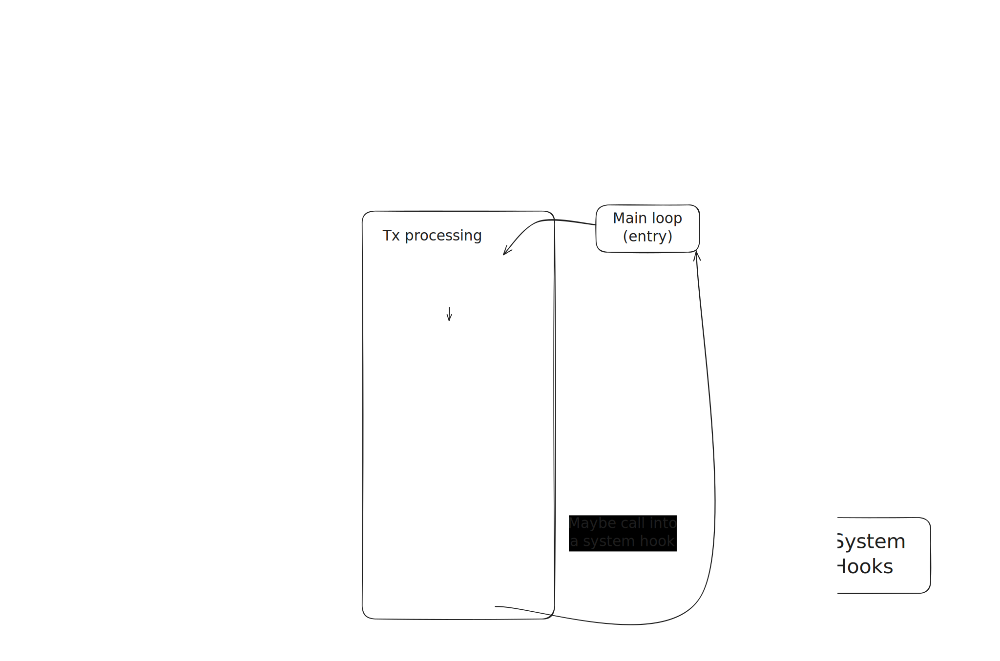

# Processing of transactions

This section describes how transactions are processed. There are 2 flows of transaction processing, one for L1 transactions and one for L2 transactions. We'll describe the latter first as it's more general and section [L1 -> L2 transactions](#l1---l2-transactions) will explain the differences in the former.

1. **Parsing**: The transaction is parsed to extract its details.
2. **Resource Calculation**: The bootloader computes the transaction's resource usage, including gas limits and intrinsic costs.
3. **Account Model Interaction**: The appropriate account model (`EOA` or `Contract`) is selected for transaction processing.
4. **Nonce Validation**: The bootloader ensures the transaction's nonce is unused.
5. **Fee Charging**: The required transaction fees are calculated and deducted.
6. **Execution**: The transaction is executed, either as a call or a deployment.
7. **Refunding**: Unused resources are refunded, with additional steps for paymasters if applicable.

The module responsible for implementing transaction processing is [`process_transaction`](../../basic_bootloader/src/bootloader/process_transaction.rs).

Transaction processing starts with the parsing of the transaction, as described in [Transaction format](transaction_format.md).

## Resources

After parsing the transaction, the bootloader computes how many resources the transaction can spend. This resource calculation involves taking the transaction's gas limit, checking it's bounded by the block's gas limit and subtracting calldata and intrinsic gas costs.

## Validation

The first step of validation done by the bootloader is checking that the nonce is not used. We use incremental nonces like the ones in Ethereum. Note that for this operation, and many like it, the bootloader needs to access the storage through the [System](../system/system.md).

Then the account model validation method is called. This performs the balance check for the token transfer, signature verification, and nonce increase.

The next step is charging the fees. This involves computing the required funds (`gas_price * gas_limit`) and performing the corresponding transfer.

### Pubdata considerations

ZKsyncOS has to publish some data to the settlement layer to ensure the rollup's state can be recovered at any time. This what we call ["pubdata"](https://docs.zksync.io/zksync-protocol/contracts/handling-pubdata), and includes state diffs after a block application and some required preimages. Given that making this data available costs money, we need to ensure that a transaction has enough resources to pay for its share of pubdata. Thus, the final step of validation is charging for the pubdata size produced after validation.

## Execution

Validation can fail for a number of different reasons, detailed in the `InvalidTransaction` type in the [Errors](../../basic_bootloader/src/bootloader/errors.rs) module. It it succeeds, the bootloader proceeds to execute the transaction.

This step is straightforward: the bootloader simply calls the account mode's execution method.

This consists of determining whether it's a normal call or a deployment. In the first case, the call is processed by the `run_single_interaction` helper, described in [Runner flow](./runner_flow.md). In the case of deployment, the bootloader will charge some extra intrinsic gas and perform the check on the init code size. After this, the deployment is processed with a call to `run_till_completion` as described in [Runner flow](./runner_flow.md).

After transaction execution, the bootloader checks if there are enough resources left for pubdata.

## Refunding the caller

The last step in the transaction processing is the refund of unused resources.

## Lifecycle of a transaction in the bootloader

To summarize, the lifecycle of an L2 transaction can be visualized as follows:

## L1 -> L2 transactions

The main difference in the processing of L1 transactions is that there is no validation step. The value for this transaction is minted, as those funds are now locked in the L1 bridge. For now, deployment transactions from L1 transactions are not supported.
