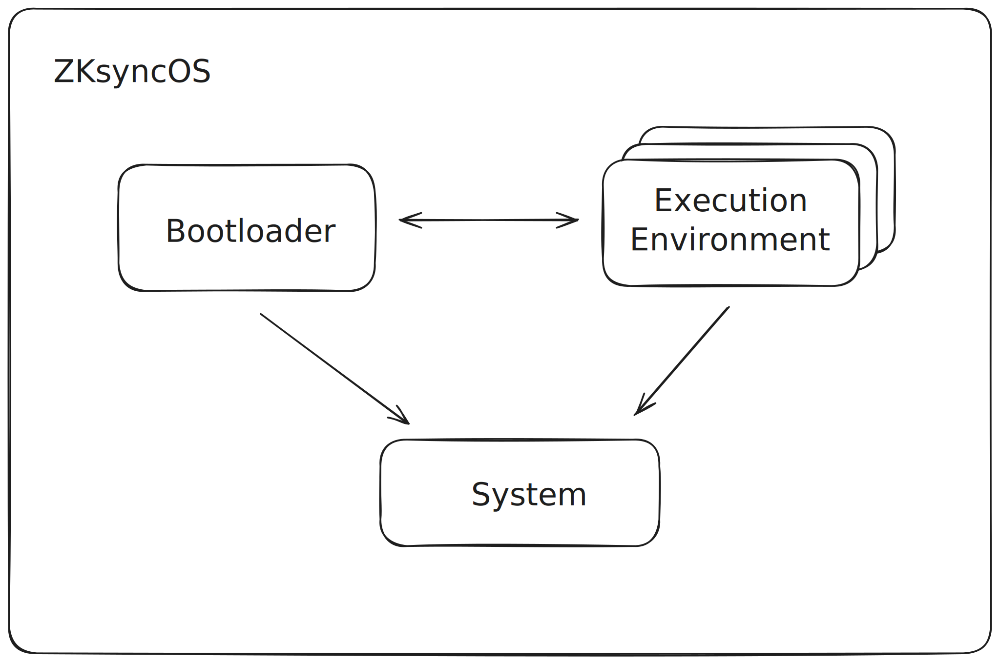

# ZKsyncOS

## Introduction

ZKsyncOS is a system-level implementation for ZKsync's state transition function. It corresponds to the operation layer of ZKsync's new architecture. As such, it's responsible for taking block data and the initial state as input and compute the new state after the application of the block.

ZKsyncOS is implemented as a Rust program that will be compiled to two targets. This first one, x86, is used for running in the sequencer. The second, RISC-V, is fed as an input to the ZKsync Airbender prover to produce the validity proof of the state transition.

The main goals for ZKsyncOS are:

- EVM equivalence: ZKsyncOS should be able to process EVM transactions keeping the EVM semantics (including gas model).
- Customizability: ZKsyncOS should be easily configurable and extended.
- Performance: the proving of an ERC20 transfer should have a cost of $0.0001. Additionally, we should be able to handle 10,000 TPS.

### Note on the name

We use the term OS because ZKsyncOS (the System component, to be precise) provides the low-level primitives to handle memory, IO, oracles and resource management. However, a lot of OS-related notions are not needed in this setting, such as multithreading, interrupts and scheduling.

## High-level design overview

ZKsyncOS is designed to support multiple VMs. This is needed to seamlessly migrate old Era chains while adding full native EVM equivalence. In addition, this will allow us to support alternative VMs, as explained [here](./execution_environments/execution_environments.md).

The main components of ZKsyncOS are:

- [**Bootloader**](./bootloader/bootloader.md): the entry point program. It initializes the system and then runs transactions using system and Interpreters.
- [**Execution Environments**](./execution_environments/execution_environments.md): regular interpreters that take bytecode, calldata, resources (similar to gas) and some other call context values as its input.
Interpreters are instantiated (with some local state) to execute a frame. When an interpreter sees a call to another contract, return/revert from current frame, or contract creation it triggers special functionality to process it, as a potentially different interpreter should be run.
- [**System**](./system/system.md): common for all environments and bootloader. Provides abstract interface for low-level handling of
 IO (storage, events, l1 messages, oracles) and memory management. The system communicates with the external oracle(non-determinism source), it’s needed to read block data, and also for some IO operations, e.g. to perform the initial read for a storage slot.

This modular design enables us to isolate a minimal interface required to implement an Execution Environment. In addition, the system abstraction makes the storage model customizable and allows for different instances of the entire system (see more in the next section).

## Running environments

As mentioned before, we have two targets for ZKsyncOS. However, this is not just a compilation target, but also how some system primitives are handled. See [Running tests](./running_tests.md) for a guide on how to run ZKsyncOS using each instantiation.

The two running environments are:

1. **Forward running mode** - to be used in the sequencer. In such mode we expect code to be run on the usual platform with OS, so default memory allocator can be used(it’s part of the OS). For non-determinism source, we can just pass Oracle rust implementation as a bootloader input. Some code can be skipped in such mode as well(for example merkle proof verification for the storage reads).
2. **Proving running mode** - to be used during proofs generation. The code is running on the pure RISC-V platform without OS, so we should manage memory, also different non-determinism source needed to pass the data inside the RISC-V machine. And we should prove everything.

In order to achieve that we want to have some way to configure the system, as mentioned above - oracle, allocator, disabling/enabling code that is needed only during proving.
