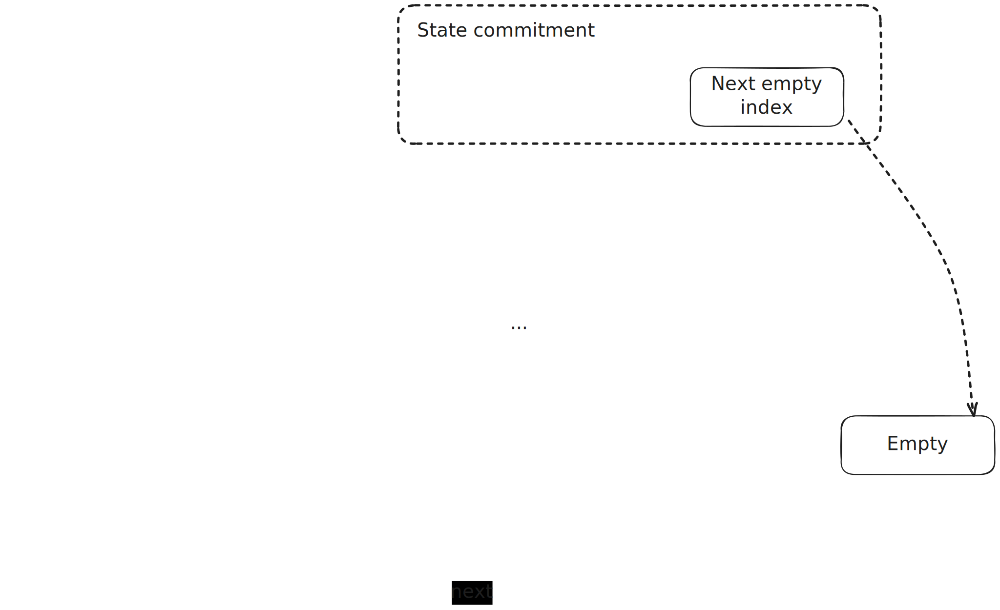

# State tree

This section describes the concrete Merkle tree used in the basic system implementation of ZKsyncOS.

We use a fixed-depth binary tree in which leaves store `(key, value)` pairs. Keys are 32-byte strings, used by the system as the Blake2S of the concatenation `address @ key` of a slot. Leaves are used up incrementally from left to right indices, 0 being the leftmost leaf. In addition to the key-value pair, each leaf stores a pointer (index) for the next leaf, forming a linked-list of a permutation of the leaves. The tree keeps as invariant that this linked-list of leaves is sorted increasingly by the leaves' keys. The key sort order is the lexicographic order.

The implementation queries the oracle to get the index for a key for the first time, and then keeps bidirectional caches for the key-index relation. So, to prove an existing read into key `k`, the tree looks for the index `i` associated to `k` in the cache and then retrieves the leaf at index `i`, verifying the Merkle hash from it to the root (`DEPTH` hashes).

The key-sorted linked-list comes in when having to prove that a key `k` is not in the tree already. This will be used either for an initial read (of the default value) or an initial write into the slot. The proof of non-membership for `k` consists in looking an index `i0` (again, through an oracle) such that it's associated key `k0` and the key `k1` of the `i0.next` leaf satisfy `k0 < k < k1`. In other ways, we prove that `k` is between two consecutive keys in the tree, which by the invariant means `k` cannot be in the list. To write a new leaf for `k`, we need to write it into the next available index `i`, and adjust the pointers such that `i0.next := i` and `i.next := i1`.

To avoid any corner cases when the key may not have next or previous in the tree we will add `key = 0` and `key = 0xFF..FF` .

To summarize some costs:

- An existing read costs `DEPTH` hashes.
- An empty read costs `2 * DEPTH` hashes (one for each of the neighbors).
- An existing write costs `2 * DEPTH` hashes (one for the initial state of the leaf and one for the final one).
- A new write costs `5 * DEPTH` hashes (2 for the "empty read", 1 for the update of the left neighbor and 2 for the update of the new leaf).

Note that this costs only refer to the final effect of the entire block over each slot. So, if in a block a give slot is read initially with value `A`, then written with value `B` and then written again with value `C`, only the update `A -> C` will be performed on the tree. The rest of the interactions are handled by the caches, as explained in the [IO overview](io.md) and [caches](caches.md) sections. In addition, the number of hashing operations is amortized. For instance, we may insert several leaves with keys between 2 adjacent keys in the tree (and/or read missing keys there); instead of querying and folding Merkle paths for the corresponding 2 leaves multiple times, we query a Merkle path for them once and fold them together with other loaded paths (i.e., we never even fold separate Merkle paths). Similarly, hashes in Merkle paths close to the root will most probably be the same for a significant portion of paths, and we don't do duplicate hashing for them either.

The tree implementation and more information can be found in [simple_growable_storage](../../../basic_system/src/system_implementation/io/simple_growable_storage.rs).

The commitment to the tree consists of the Merkle root (using Blake2S as hash function) together with the index of the next available leaf, to make insertion deterministic. The current implementation uses `DEPTH = 64`.
